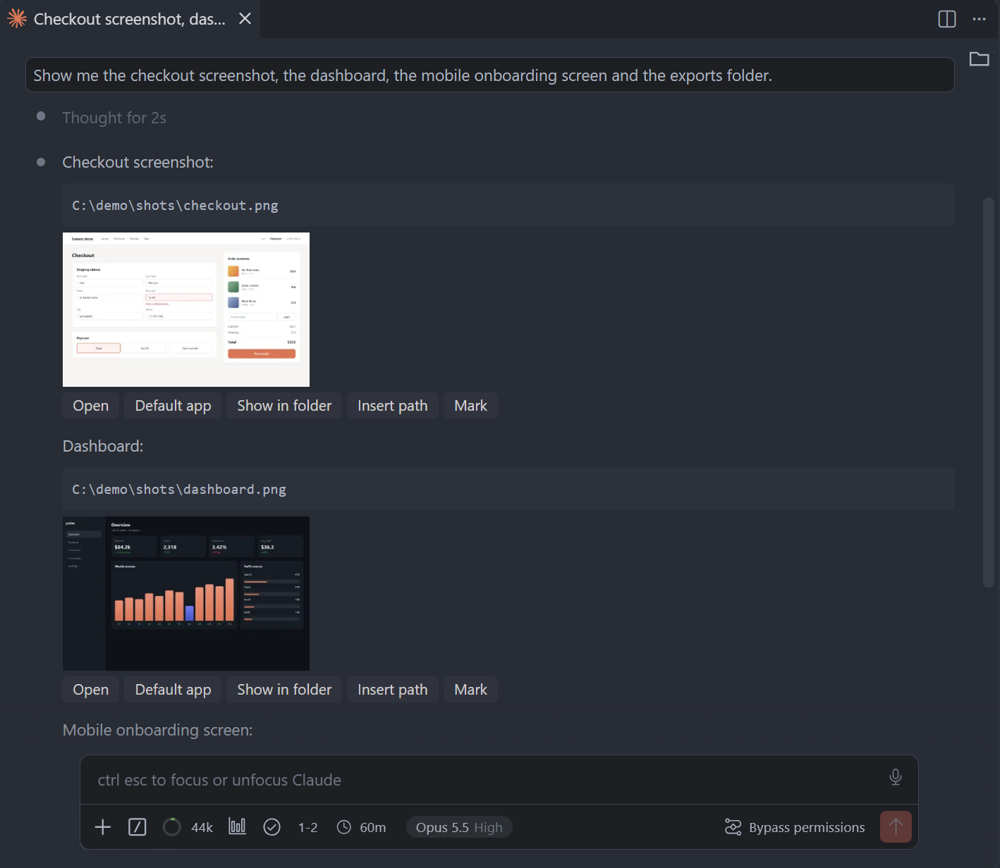
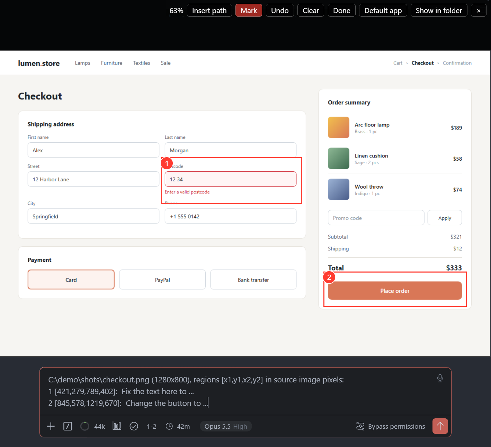
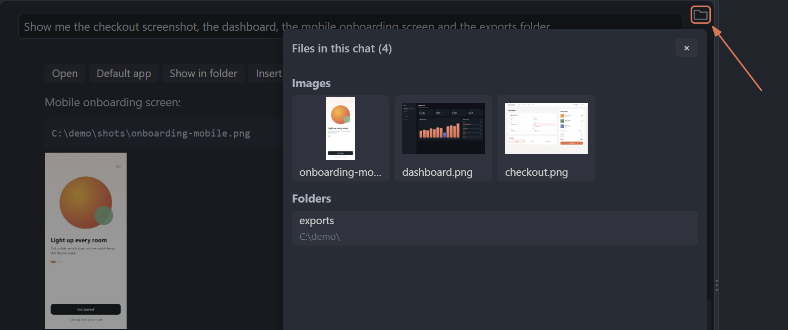
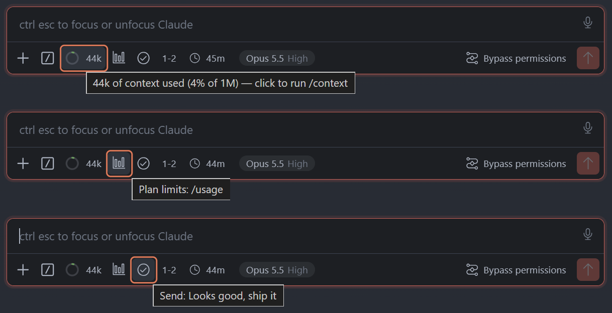
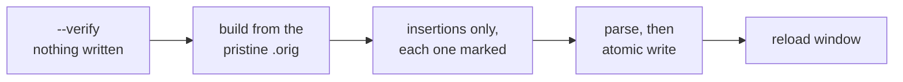

<div align="center">

# vscode-claude-code-patch

### Claude Code skill (VS Code, Windows): image previews and open buttons under file paths in the chat, clickable local links, a context ring and your own composer buttons

[](LICENSE)
[](https://code.claude.com/docs/en/skills)
[](https://marketplace.visualstudio.com/items?itemName=anthropic.claude-code)

**Claude names a file, and the chat shows it: a preview card right under the path with Open, Default app and Show in folder, a viewer to zoom in, and a Mark mode that hands Claude numbered boxes in the image's own pixels.
The chat has no API for any of this: the skill inserts code into the installed Claude Code extension, keeps the pristine files beside it, and `--revert` puts them back byte for byte.**

[Installation](#installation) · [Usage](#usage) · [How it works](#how-it-works) · [Limitations](#limitations)

*Unofficial: not affiliated with or endorsed by Anthropic. No Anthropic code is distributed here; the skill edits the copy of the Claude Code extension already installed on your machine.*

</div>

---

## What it does

<p align="center"></p>
<p align="center"><sub>Claude names a file, and a card with a preview and open buttons appears right under the path.</sub></p>

In the stock Claude Code chat a path in an answer is text. To see the screenshot Claude just made you
copy the path, switch to Explorer and dig for the file; to show Claude which part of it is wrong you
describe it in words and hope. This skill patches the chat so the file comes to you:

- **A card under every path.** An absolute Windows path in an answer gets a card by kind: an image a
  preview with **Open** (a VS Code tab), **Default app** and **Show in folder**; a `.psd` a
  **Photoshop** button (only where Photoshop is installed); a folder **Open folder**; other files
  **Open** and **Show in folder**, or only the latter for PDFs, Office files and archives. Markdown
  links and images that point at `C:\...` work too, where the stock chat drops them.
- **A viewer.** Click a preview: the wheel zooms at the cursor, drag pans, double-click fits, Esc closes.
- **Mark.** Draw numbered boxes on the image, press **Done**, and the prompt box gets the path, the
  image size and one line per box in the file's own pixels, ready for a word after each colon:

  ```text
  C:\Users\example\shots\checkout.png (1920x1080), regions [x1,y1,x2,y2] in source image pixels:
  1 [412,88,760,140]:
  2 [1210,640,1580,712]:
  ```

  **Insert path** puts the bare path at the cursor instead: a path, not an `@` mention, so the image is
  not loaded into the context until Claude decides to read it.

  
- **The files panel.** A folder button at the top right of the chat lists every file this chat has
  shown: images as thumbnails, then folders, then other files, newest first. A click acts like the
  card's buttons.

  
- **The context ring.** How full this chat's context is, right after the composer's `/` button: a ring
  and the count (`184k`), green until 256k tokens or 60% of the window, clay orange past either. A click
  runs `/context`.

And one add-on, offered once the setup is done:

- **Your own composer buttons.** Up to five, each running a slash command, sending a fixed message or
  inserting a line into the prompt box: one click for what you now type. A button shows an icon or a
  short label of up to three characters (the `1-2` below inserts a line). Your agent can propose them
  from the commands and skills you actually have.

  

| At a glance | |
|---|---:|
| What it does | **cards with previews and open buttons under file paths in the chat** |
| Also in the base install | **image viewer, Mark and Insert path, local links, chat files panel, context ring** |
| Add-on | **up to five composer buttons of your own** |
| Where it works | **Windows, VS Code with the Claude Code extension** |
| Survives extension updates | **yes, a SessionStart hook re-applies it** |
| When an update breaks a part | **that part is left out, the rest keep working, your agent repairs it** |
| Undo | **`--revert`, byte for byte from the pristine copy** |
| Labels | **English or Russian** |
| Requires API keys | **no** |
| External dependency | **Node.js 16.9+, no npm packages** |
| License | **MIT** |

**What it changes on your machine. Read this before you install.**

- **Two files of the installed Claude Code extension**, edited in place: `webview/index.js` (the chat
  window) and `extension.js` (the extension host, which is what can read an image from disk and open
  it). The pristine copy of each stays beside it as `<file>.orig`, and one command, `--revert`, puts
  both back byte for byte.
- **The composer's stock context counter is switched off:** the ring takes its place, and the
  counter's click, which compacted the chat on the spot, goes with it (`/compact` still works typed).
  Ask your agent to turn the ring off and the stock counter is back after a window reload.
- **One SessionStart hook** in `~/.claude/settings.json`, so the patch comes back after every
  extension update. The file is copied once to `settings.json.ccp.bak` before the first write and
  saved back as plain 2-space-indented JSON (your own formatting of it is not kept), other hooks are
  left alone, and `--uninstall-hook` removes exactly this entry.
- **One rule in your `CLAUDE.md`, and only if you say yes:** how Claude should write file paths so that
  cards appear under them. Appended, never rewritten.
- **Its own state** in `%USERPROFILE%\.claude\vscode-claude-code-patch.*`: config, a ledger of pristine
  checksums, a fingerprint cache, a lock.
- **Only if your agent repairs a part after an extension update:** a staging copy of the skill, a copy
  of the new build's two bundles to test against, and the fix as a diff, all in
  `%LOCALAPPDATA%\vscode-claude-code-patch`. They stay there for the next repair.

Nothing else is written. The patch makes no network calls; a repair is offered to this repository as
an issue only on your yes.

## Why

- **A path in an answer is dead text.** Claude says the render is at `C:\...\hero.png`, and seeing it
  means copying, switching windows and navigating. Many times a session.
- **Pointing at part of an image is guesswork.** "The button at the top right" is read by a model that
  sees the picture at its own scale. A box in the file's own pixels leaves nothing to guess.
- **Files scroll away.** The image from an hour ago is forty screens up. The files panel keeps every
  one the chat has shown in one place.
- **Every extension update wipes a patch.** Claude Code ships a new build every day or two, each into
  a fresh folder. The hook puts the patch back at the next session start, before you notice it went.
- **There is no supported route.** The extension offers no extension point for its chat, and neither
  does VS Code. Without patching the bundles none of this can exist.

## Installation

One command, and the skill is available as `/vscode-claude-code-patch`:

```bash
npx skills@latest add warodan/vscode-claude-code-patch -g
```

After it installs, **restart your agent** — skills are read at startup.

**Install it globally, with `-g`.** The SessionStart hook lives in your user-wide
`~/.claude/settings.json` and points at the skill's folder. A project install would tie it to that
one project, and moving or deleting the project would leave every session with a broken hook. Found
inside a project, the skill says so and recommends the global install before it writes anything.

The [skills.sh](https://skills.sh/) installer asks which agents to install it for. Node.js is needed
for that command, and the skill uses the same Node (see [Requirements](#requirements)).

**Expect the installer to flag this skill as high risk, and it would not be wrong.** skills.sh runs
third-party security scanners on every install; for this skill's predecessor they reported
`Med Risk` / `Critical Risk`, and this one edits more. The skill's entire job is to change files inside
an extension you already have. [What it changes](#what-it-does) is listed above, [How it
works](#how-it-works) shows every guard, and [Limitations](#limitations) says plainly what can go
wrong. Read those before you install it.

**Installing the skill changes nothing in VS Code. Setting it up is a second step, and you ask for it.**
The skill is instructions for your agent, not an installer. Once the agent has restarted, tell it:

```text
install the Claude Code chat patch
```

It checks for the predecessor skill and runs a preflight that writes nothing, then tells you in a few
lines what it is about to change and waits for your yes. Only then does it build the base parts
and install the SessionStart hook. Then it reads your `CLAUDE.md` files for a rule on
how paths are written, since cards appear only under paths written a certain way; if there is none it
explains that in two lines and offers to append one, only on your yes. It asks you to reload the VS
Code window and confirm that a card shows and the ring is in place, and finally offers composer
buttons fitted to your own commands and skills.

**The labels are English or Russian.** For Russian from the start, say so in the same request:

```text
install the Claude Code chat patch with Russian labels
```

If you write to your agent in Russian, it picks Russian by itself and says so in the message that
asks for your yes. The language can be switched at any time later.

### Or have your agent install it

No terminal of your own, no flags to choose. Open Claude Code and paste this to it:

```
Install the vscode-claude-code-patch skill for me. Run in the terminal:

npx skills@latest add warodan/vscode-claude-code-patch -g -y -a claude-code

If npx is not found, give me a link to download Node.js and wait.
Do not install anything else.
When you are done, tell me in one line that it is ready and that I need to restart the session.
```

The agent does the rest. This is the **first** install; updating is a different command, below.

### Updating and removing

```bash
npx skills@latest update -g vscode-claude-code-patch
npx skills@latest remove -g vscode-claude-code-patch
```

After an update there is nothing to re-run: the hook sees that the skill's own files changed and
rebuilds the patch with the new code at the next session start, then tells you to reload the window.

**Removing the skill? Take the patch and the hook out first.** The hook calls a script inside the skill
folder, and `remove` deletes that folder without touching your settings, so every session would start
with a hook that fails. Ask your agent to `undo the patch and remove the hook` (it runs `--revert` and
`--uninstall-hook`), reload the window, then run `remove`. It also offers to take the paths rule out of
`CLAUDE.md` if it added one.

**What stays after `remove`:** the state files `%USERPROFILE%\.claude\vscode-claude-code-patch.*`, the
backup `%USERPROFILE%\.claude\settings.json.ccp.bak`, and `%LOCALAPPDATA%\vscode-claude-code-patch` if a
repair ever ran. Nothing uses them any more; delete them by hand if you want them gone.

### Coming from vscode-claude-chat-context-meter

This skill replaces [vscode-claude-chat-context-meter](https://github.com/warodan/vscode-claude-chat-context-meter).
Its ring is part of this skill's base install (`context-meter`), drawn the same way, and its custom buttons can be
recreated as buttons that, unlike there, survive extension updates.

The two cannot run side by side: both rebuild the same `webview/index.js` from the same
`index.js.orig`, each from its own hook, and would erase each other at every update. So while the old
skill's hook is in your `settings.json`, this one refuses to build or to install its own hook, and
names the exact commands that clear the way.

You do not have to do the move by hand. Install this skill and ask for the setup as above: it finds
the old one, shows you four steps (remove its hook, undo its patch, remove its folder, then set this
one up) and runs the old skill's commands only after your yes. The steps and the button mapping:
[migrate-from-v1.md](skills/vscode-claude-code-patch/references/migrate-from-v1.md).

## Usage

After the setup there is nothing to call. Any answer with a path written the way the rule asks gets a
card, and the folder button at the top right of the chat opens the files panel. The skill is picked up
on its own when you ask for something it covers:

```text
install the Claude Code chat patch
```

First run, described in [Installation](#installation).

```text
switch the chat patch labels to Russian
```

Every label, tooltip and the text Mark puts into the prompt box. Say English to switch back.

```text
add a button that runs /usage
```

```text
propose composer buttons for how I work
```

One read-only subagent reads the frontmatter of your commands, skills and plugins and the headings of
your `CLAUDE.md` (never session transcripts, `.env` files or memory), and you get a table of up to
five suggestions to pick from and edit. The buttons live in the config, so the hook rebuilds them after
every extension update.

```text
fix the Claude Code chat patch
```

For the day the hook reports a part as `UNSAFE` after an extension update. The agent repairs it in a
staging copy, tests it, and only then replaces the installed skill; see [How it works](#how-it-works).

```text
check whether the patch is still safe on this version
```

The read-only preflight: every enabled part built and parsed in memory, `SAFE TO PATCH` or exactly
what did not match, nothing written. If a part is `UNSAFE`, the agent tells you and offers the repair;
it starts only on your yes.

```text
undo the patch, I want the extension back the way it was
```

`--revert` restores both files from their pristine copies, and the hook re-applies nothing until you
ask for a build again.

Or call it explicitly:

```text
/vscode-claude-code-patch install the chat patch with Russian labels
```

**If no Claude Code chat opens at all**, Claude is not there to fix it. Run this in any PowerShell
window (the path is where a global install puts the skill), then Developer: Reload Window. It loads no
part of the patch, so it works even when a skill file is broken:

```powershell
node "$env:USERPROFILE\.claude\skills\vscode-claude-code-patch\claude_code_patch.mjs" --revert
```

If that fails too: Extensions → Claude Code → Uninstall, then Install. Settings and sessions survive.

## How it works



1. **Two files, found where VS Code keeps them.** Under `%USERPROFILE%\.vscode\extensions`, every
   `anthropic.claude-code-*` folder: `webview/index.js`, the ~5 MB minified bundle behind every Claude
   Code chat (sidebar, editor tab, separate window), and `extension.js`, the extension host. Only the
   cards touch the host; the viewer, Mark, the files panel, the ring and the buttons live in the webview.
2. **Preflight first.** `--verify` runs the whole build with writing switched off and answers per part:
   `SAFE TO PATCH`, or `UNSAFE: <part>/<target>: <what did not match>`.
3. **Derived, not hardcoded.** Minified names change with every build, so each part re-derives them
   from anchors that must occur exactly once, and refuses rather than guesses. Every edit is an
   insertion marked `/*CC-...*/`, and every build starts from the pristine copy, never from a patched file.
4. **Parse before writing, write atomically.** Each assembled file is parsed; if one does not parse,
   nothing is written anywhere. The pristine copy is saved as `.orig` first, then each file goes to a
   temporary copy that is read back, checked by sha1 and renamed over the original. A ledger keeps the
   pristine sha1 of each extension version, and a "pristine" copy that disagrees is refused.
5. **A broken part is left out, not forced.** When a new extension build moves code one part depends
   on, that part is `UNSAFE` and skipped; the others are built and keep working.
6. **Self-repair, tested before it is applied.** Your agent repairs the part in a staging copy under
   `%LOCALAPPDATA%`, runs the skill's suite of about 240 tests against a copy of the new build, checks
   `--verify`, and only then replaces the installed skill. It saves the diff and offers to send it here
   as an issue, so the fix reaches everyone; nothing is sent without your yes.

### Surviving extension updates

`--install-hook` writes one SessionStart hook into `~/.claude/settings.json` that runs `--ensure` in
the background. On the everyday path it compares a few file fingerprints and exits without opening a
bundle. It rebuilds when the extension version changed, when your config changed, or when the skill's
own files changed, which is how an `npx skills update` or a repair takes effect at the next session
start. When it has something to say, it sends one message your agent sees: rebuilt, reload the window;
or a part is `UNSAFE`, ask Claude to fix the chat patch. A lock keeps two windows starting at once from
writing the same file, and the hook never fails a session start. After `--revert` it stays silent and
re-applies nothing until you build again. A restored patch appears at the **next window reload**; the
update asks for one anyway.

## Requirements

| Requirement | Details |
|---|---|
| Windows | on macOS and Linux every command but `--help` stops with `Windows only for now` |
| VS Code with the Claude Code extension | `anthropic.claude-code`, installed in the standard `%USERPROFILE%\.vscode\extensions`. VS Code Insiders, Cursor, Windsurf, VSCodium and remote installs are not searched |
| Claude Code as the agent | it is Claude Code's chat that gets patched, and the self-heal is a Claude Code SessionStart hook |
| Node.js 16.9 or newer, on PATH | runs the patcher; no npm packages. The hook records the absolute path of `node.exe`, so after Node moves to another folder ask your agent to reinstall the hook. The self-repair test suite needs Node 20.10 or newer |
| Write access to the extension folder | the patch edits two files there and keeps their pristine copies beside them |
| Photoshop (optional) | only for the Photoshop button on `.psd` and `.psb` cards; without it the button is not shown |

## What's inside

```
vscode-claude-code-patch/                  # the repository
├── skills/vscode-claude-code-patch/       # ← the only thing that gets installed
│   ├── SKILL.md                 # the skill: setup, commands, reading the output, known limits
│   ├── claude_code_patch.mjs    # the engine and CLI, Node built-ins only
│   ├── lib/layout.mjs           # finds the composer panel in the minified bundle
│   ├── parts/                   # one module per part: chat-media, chat-mark, chat-files,
│   │                            #   context-meter, chat-icons
│   ├── assets/                  # the code the parts insert: webview helpers, host snippets
│   ├── references/
│   │   ├── composer-addons.md   # the context ring and your own buttons
│   │   ├── migrate-from-v1.md   # moving from vscode-claude-chat-context-meter
│   │   ├── self-repair.md       # fixing a part an extension update broke
│   │   ├── layout-recovery.md   # finding the anchors a new build moved
│   │   └── internals.md         # every edit, guard and state file
│   ├── tools/mirror.mjs         # exact copy with a sha1 check, used by self-repair
│   ├── tests/                   # the suite self-repair runs before applying a fix
│   └── LICENSE
├── assets/                                # the screenshots this README shows
├── LICENSE
└── README.md
```

## Limitations

- **Windows and VS Code only.** Only `%USERPROFILE%\.vscode\extensions` is searched, so Insiders,
  Cursor, Windsurf, VSCodium and remote or WSL installs are not patched.
- **It patches an installed extension, and that is a real risk.** A broken `extension.js` means no
  Claude Code chat opens in that window. The engine writes it only when the trial build parses and
  only by renaming a complete, verified copy over it, and `--revert` above works from any terminal.
  But the honest summary is: this is a patch, not an integration.
- **Cards appear only under paths written a certain way:** an absolute Windows path alone in a fenced
  code block, or a markdown image or link to a drive path. By default the extension tells Claude to
  write workspace-relative links, which get no card. That is what the `CLAUDE.md` rule is for.
- **An extension update can take a part out until it is repaired.** A build that moves code a part
  depends on makes that part `UNSAFE`; the rest keep working. A repair lives in your installed copy
  until it is published here, and an `npx skills update` to a version without it brings the `UNSAFE`
  back.
- **Every change shows after Developer: Reload Window.** The chat is already loaded by the time a
  session starts, so the hook cannot put a restored patch into a window that is open.
- **Any image path Claude writes is previewed without a click:** read only, image files up to 100 MB;
  nothing is launched without a click. Past 100 MB there is no preview, the buttons still work.
- **The files panel sees what the chat window keeps in memory,** about the last 500 records, and only
  what the main agent showed: files touched only by subagents are not in it.
- **Default app and Open folder hand the path to Explorer,** which treats commas in a name specially:
  a planted file whose name holds commas might open another item than the one clicked (not verified).
- **Other patches of the extension are not supported.** The predecessor skill is refused while its
  hook is present; another tool's patch is refused or dropped by the next build.

### When it's not a fit

| Situation | What to do instead |
|---|---|
| You are on macOS or Linux, or use Cursor, Windsurf or Insiders, and want the context ring | [vscode-claude-chat-context-meter](https://github.com/warodan/vscode-claude-chat-context-meter), the predecessor: the ring alone, on any platform and in those editors |
| You may not modify installed extensions (a managed or shared machine) | nothing equivalent; ask Claude to run `code <path>`, which opens a file in a VS Code tab |

## License

MIT — see [LICENSE](LICENSE). © 2026 Daniel Orr.

An unofficial, independent project, not affiliated with or endorsed by Anthropic. "Claude" and "Claude
Code" are Anthropic's marks; the extension this skill patches is theirs. No Anthropic code is
distributed: the skill edits the copy already installed on your machine, keeps the original beside
it, and the repository holds only short search patterns that find where to insert.

The composer button icons are glyphs of [Codicons](https://github.com/microsoft/vscode-codicons) by
Microsoft, licensed under [CC BY 4.0](https://creativecommons.org/licenses/by/4.0/), converted to SVG
paths.

---

<div align="center">
<sub><b>Skills for Claude Code</b> · <a href="https://github.com/warodan?tab=repositories">more skills in the series</a></sub>
</div>
